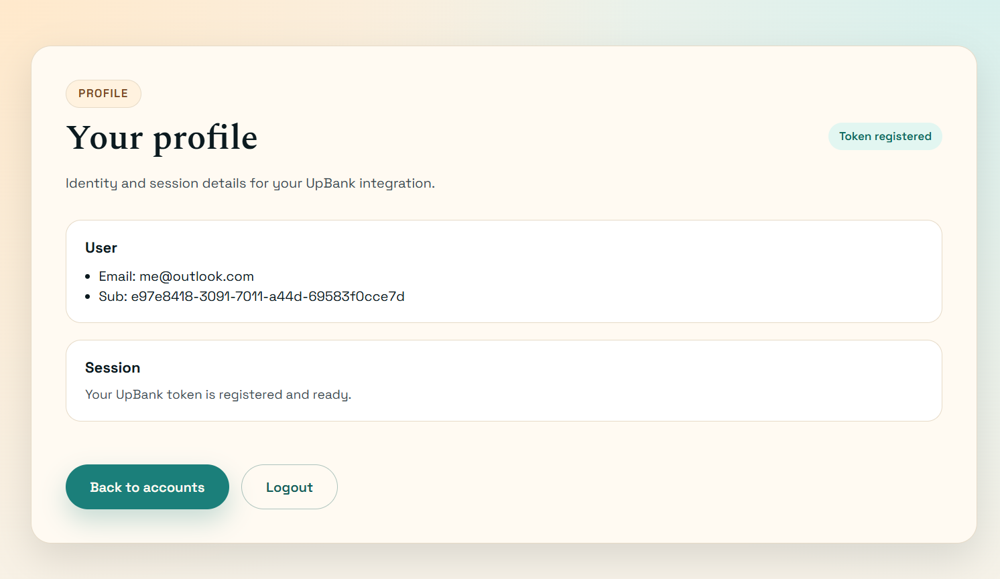
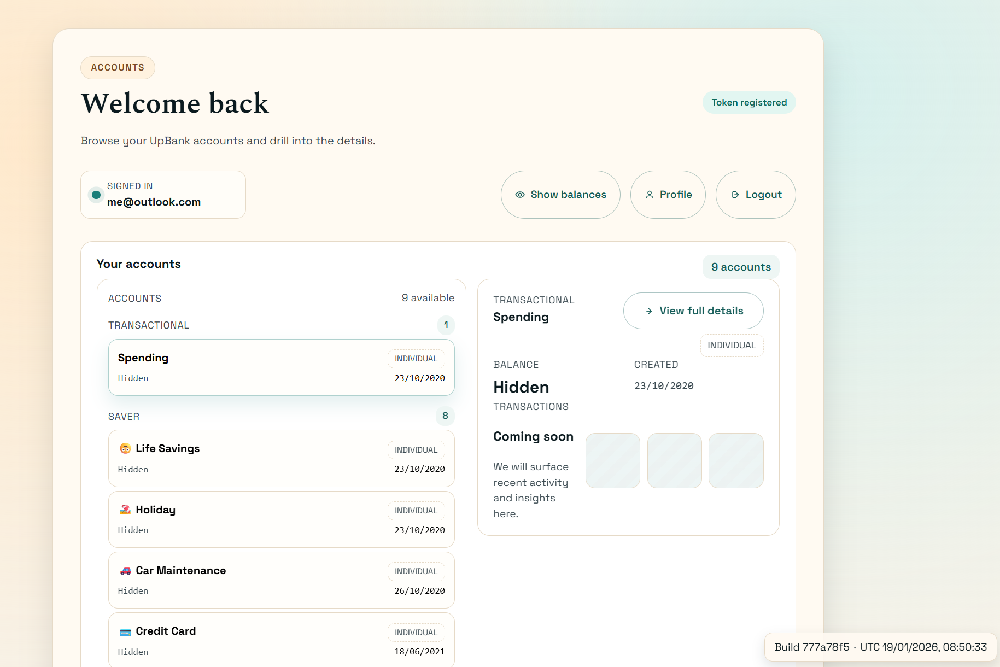

# 🧪 Up Bank AWS End-to-End Architecture Lab

## 1. Purpose of This Lab

This repository contains a **deliberately realistic, end-to-end AWS architecture lab** focused on how modern cloud applications are:

* **designed**
* **secured**
* **operated**
* **integrated**
* **evolved**

using **production-grade AWS managed services and Kubernetes patterns**.

The lab integrates with the **Up Bank public API** to introduce real external dependencies, real authentication constraints, and real security trade-offs — while intentionally avoiding shortcuts that hide how systems actually behave.

The goal is **architectural understanding**, not just functionality.

---

## 2. Business Context & Problem Statement

A fintech-style application needs to:

* Authenticate users securely
* Allow users to connect their Up Bank account using a personal access token
* Retrieve and display account information
* Expose APIs suitable for frontend consumption
* Scale without managing backend servers
* Keep sensitive tokens off the client
* Remain reproducible, observable, and cost-aware

---

## 3. Core Architectural Principles

This lab is guided by the following principles:

* **Managed services first**
* **Identity-centric security (IAM > networking)**
* **No secrets in the frontend**
* **Serverless backend where possible**
* **Incremental realism over shortcuts**
* **Cost and scale matter, even in labs**

---

## 4. High-Level Architecture Concept

The platform is composed of:

* **Frontend**

  * React SPA hosted on Amazon EKS
  * Served via Nginx behind an Application Load Balancer

* **Authentication**

  * Amazon Cognito (OAuth2 / OIDC, Hosted UI, PKCE)

* **API Layer**

  * AWS AppSync (managed GraphQL)

* **Integration Layer**

  * AppSync pipeline resolvers (no Lambda)

* **Token Storage**

  * Amazon DynamoDB (user-scoped token records)

* **External Dependency**

  * Up Bank public REST API (HTTPS)

* **Compute Platform**

  * Amazon EKS (frontend only)


---

## 5. Phased Implementation Overview

This lab was implemented incrementally to reflect how real systems evolve.

---

## Phase 1 — Infrastructure & Kubernetes Baseline (Completed)

### Goal

Establish a **stable, debuggable Kubernetes platform** on AWS.

### Implemented

* VPC with public/private subnets
* NAT Gateway for outbound access
* Amazon EKS cluster
* Managed EC2 node group
* Core EKS addons:

  * VPC CNI
  * CoreDNS
  * kube-proxy
* AWS Load Balancer Controller
* Baseline `nginx` deployment exposed via ALB

### Key Learnings

* Nodes can exist but still be unusable
* VPC CNI is a hard dependency
* Most EKS failures are wiring issues, not instance size
* Observability is mandatory to debug infra

---

## Phase 2 — Observability & Monitoring (Prometheus + Grafana)

### Goal

Introduce **production-style Kubernetes observability**.

### Implemented

* `kube-prometheus-stack` via Helm
* Prometheus:

  * node exporter
  * kube-state-metrics
* Grafana dashboards:

  * cluster health
  * node & pod resources
  * deployment stability

### Outcome

Clear separation between:

* platform issues
* application issues
* infrastructure misconfiguration

---

## Phase 3 — Authentication (Cognito)

### Goal

Introduce **secure user authentication** without managing credentials.

### Implemented

* Amazon Cognito User Pool
* OAuth2 Authorization Code Flow with PKCE
* Hosted UI login
* JWT issuance
* AppSync configured with Cognito User Pool authentication

### Outcome

* Frontend never handles passwords
* Identity is verified once
* JWT becomes the trust boundary

---

## Phase 4 — API Layer & External Integration (AppSync)

### Goal

Expose a **GraphQL API** without running backend servers.

### Implemented

* AWS AppSync GraphQL API
* JS runtime resolvers only (no VTL)
* Pipeline resolvers:

  1. Identify user via Cognito JWT
  2. Retrieve Up Bank token from DynamoDB
  3. Call Up Bank REST API via HTTP data source
  4. Map REST → GraphQL

### Important Notes

* No Lambda is used in this phase
* AppSync orchestrates DynamoDB + HTTP directly
* Tokens are never returned to the client

---

## Phase 5 — Token Storage Strategy

### Design Decision

Tokens are stored in **DynamoDB**, not Secrets Manager.

**Why DynamoDB**

* Better horizontal scalability
* Lower cost at scale
* Easier schema evolution
* Token treated as application data, not infrastructure config

### Current State

* Token stored in plain text (for learning clarity)
* DynamoDB provides AWS-managed encryption at rest

### Planned Improvement

* Application-level encryption (KMS)
* Optional Lambda token vault broker

---

## Phase 6 — Frontend Application (UI)

### Overview

The frontend is a **React Single Page Application** hosted on EKS and served via Nginx.

It is responsible for:

* User login
* Token registration
* Account discovery
* Account detail visualization

The frontend **never** sees:

* DynamoDB records
* Up Bank tokens
* Backend credentials

### Key UI Screens

#### User Profile

Displays authenticated user details and token registration status.



---

#### Dashboard

High-level overview of connected accounts.



---

#### Account Details

Detailed view of an individual Up Bank account.


---

#### Landing Zone (Architecture Explorer)

The Landing Zone page is a portfolio-grade onboarding and architecture walkthrough. It includes:

* A step-by-step PAT onboarding flow
* A client-side PAT registration widget (mocked, ready to swap with AppSync)
* An interactive infrastructure diagram with node-level details, filters, and zoom/pan

Core files:

* `app/src/pages/LandingZonePage.tsx`
* `app/src/config/architecture.ts`

To extend it, update `architecture.ts` for new nodes/edges or replace the token client with AppSync calls.

---

### Runtime Configuration

* Environment config loaded from `runtime-config.json`
* Build metadata (commit hash + build time) baked into the image
* Allows the same image to be promoted across environments

---

## Phase 7 — CI/CD & State Management

### Terraform

* Remote state stored in S3
* DynamoDB used for state locking
* Works both locally and via automation

### Kubernetes

* Base manifests applied via bootstrap workflow
* Normal releases are image rollouts only
* Deployment annotated with:

  * commit hash
  * build datetime

---

## 6. Domains Explored in This Lab

* AWS networking & managed services
* Kubernetes (EKS) operations
* Identity & authentication (Cognito)
* GraphQL API design (AppSync)
* Secure token handling
* Observability & debugging
* CI/CD patterns
* Cost & scalability trade-offs
* Platform engineering thinking

---

## 7. Future Improvements & Architecture Evolution

This lab was intentionally designed to evolve without requiring architectural rewrites.
The following improvements represent **natural next steps** aligned with real production systems.

---

### 7.1 Token Vault Broker (Lambda-based)

**Current state**

* AppSync retrieves the Up Bank token directly from DynamoDB
* Token stored in plain text (with AWS-managed encryption at rest)

**Planned improvement**

* Introduce a **Token Vault Lambda** acting as a broker:

  * AppSync no longer accesses DynamoDB directly
  * All external API calls flow through the broker
  * Token retrieval, decryption, and downstream calls are centralized

**Benefits**

* Stronger security boundary
* Centralized token lifecycle management
* Easier rotation, auditing, and revocation
* Reduced blast radius if a resolver is misconfigured

---

### 7.2 Application-Level Encryption (KMS)

**Current state**

* DynamoDB provides encryption at rest (AWS-managed keys)

**Planned improvement**

* Encrypt tokens **before persistence** using AWS KMS
* Decrypt only at runtime inside the token broker

**Benefits**

* Defense in depth
* Token unreadable even to DynamoDB operators
* Strong compliance posture (PCI / banking-style controls)

---

### 7.3 GitOps for Kubernetes (Option B)

**Current state**

* Kubernetes base resources applied via bootstrap workflow
* App deployments performed via rollouts

**Planned improvement**

* Introduce **Argo CD or Flux**
* Kubernetes manifests become the source of truth
* Cluster continuously reconciles desired state

**Benefits**

* Drift detection and correction
* Declarative cluster state
* Cleaner separation between infra and app delivery

---

### 7.4 Multi-Environment Promotion

**Current state**

* Single environment focus (dev-style)

**Planned improvement**

* Multiple environments (dev / staging / prod)
* Separate AppSync APIs and Cognito User Pools
* Environment-specific runtime configuration via ConfigMaps

**Benefits**

* Safer promotion paths
* Realistic enterprise deployment model
* Reduced coupling between environments

---

### 7.5 Observability & Tracing

**Planned additions**

* AppSync field-level metrics
* Structured error logging
* Correlation IDs across:

  * Frontend
  * AppSync
  * Token broker (future)

**Benefits**

* Faster root cause analysis
* Clear ownership boundaries
* Production-grade diagnostics

---

### 7.6 Rate Limiting & Resilience

**Planned improvements**

* AppSync resolver throttling
* Retry and backoff strategies for Up Bank API
* Circuit breaker patterns (broker-based)

**Benefits**

* Protects external dependencies
* Prevents cascading failures
* Improves customer experience during outages

---

## 9. Final Note

## 7. Why This Lab Exists

This project is **not a tutorial** and **not a happy-path demo**.

It exists to:

* Surface real failure modes
* Practice diagnosing distributed systems
* Build architectural judgment
* Understand AWS service boundaries

The outcome is not just a working system —
it is **operational understanding**.

This lab is intentionally structured to reflect **how real systems are built, reviewed, and evolved**:

* Managed services over custom code
* Clear trust boundaries
* Incremental hardening
* Cost-aware decisions
* Operational realism

Each phase builds on the previous one without invalidating earlier work — mirroring real production constraints.

---

```powershell
aws eks update-kubeconfig `
  --region ap-southeast-2 `
  --name upbank-lab-prod `
  --alias upbank-prod
```
